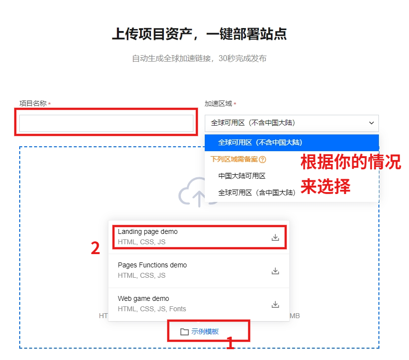

# CNB静态博客系统

**CNB博客** - 让分享更简单 🚀 人人有好博！

基于CNB Issues API构建的现代化静态博客系统，使用Next.js 15、React 19、TypeScript和Tailwind CSS开发。

## 🚀 项目特性

- **静态生成**: 使用Next.js静态站点生成(SSG)，确保极速加载
- **现代化UI**: 基于Tailwind CSS和shadcn/ui组件库的响应式设计
- **深色模式**: 支持明暗主题自动切换
- **TypeScript**: 完整的类型安全支持
- **SEO优化**: 完整的元数据、sitemap和结构化数据
- **PWA支持**: 包含Web App Manifest
- **API集成**: 与CNB Issues API无缝集成
- **Markdown增强**: 支持代码高亮、数学公式、目录导航
- **部署就绪**: 支持Cloudflare Pages、EdgeOne Pages等所有静态部署平台

## 使用CNB ISSUE做博客的好处：
- `拖放式上传图片及文件，复制的图片可以直接粘贴到输入区域（包括评论中），使用体验好`
- `关注CNB公众号后，ISSUE评论回复会有在微信服务号中得到通知，交流互动及时`
- `CNB=国内版Github,永久免费不是吹`
- `CNB API相当完善，你自己用AI写一个静态网站也可以`
- `你直接拿CNB ISSUE系统来做博客做记录就可以，但静态网站部署后，利于SEO，便于你的内容被搜索引擎收录`
- `写博客做记录有很多好处，用CNB能以最简便的方式让你写博客，获取写博客的好处`

### Todo

- 完成喂饭级部署教程（edgeone篇）：`- [] `
- 完成分类及标签页面：`- [] `
- 增加按钮触发构建：`- [x] 完成 `
- 增加ISSUE触发构建：`- [] `
- 增加外部发布ISSUE功能：`- [] `
- 指定用户来构建静态网站，防止无关issue写入静态网站中：`- [] `
- 接入AI API：`- [] `
- 完成喂饭级部署教程（firebase、cf pages、vercel、github篇）：`- [] `
- 更好的前端主题样式：`- [] `

## 🌐 部署指南

### ISSUE博客系统 【核心系统，太好用了】

- #### fork为自己的仓库，创建一篇issue
- #### 点击橙色的云原生开发进行后台，等待一会打开弹出通知的网址即可查看网站了。
- #### 这是直接拿issue作为记录的平台，开箱即用！以下构建为静态博客网站为可选项。
- #### 有问请查看 https://cnb.cool/aii.mobi/blog/-/issues/2


### EdgeOne Pages 【部署为静态，利于SEO,为可选项】

先Fork我这个仓库，然后根据以下的步骤来操作，不难的。


1. 用邮箱注册EdgeOne，[网址](https://edgeone.ai/)


2. 来创建一个page项目:


在这里新建 https://console.tencentcloud.com/edgeone/pages

点击选择“直接上传”的方式。



进入部署页面，加整区域根据你的需求来选择。

之后点击示例模板，随便选一个，之后左上角修改项目名称为：“cnb-issue-sites”。

之后点击开始部署。

4. 获取API token

创建复制即可。

5. 之后在cnb中新建一个密码仓库，增加一个文件，名称为：'envs.yml'

内容为：

```
# envs.yml
# 获取网址：https://console.tencentcloud.com/edgeone/pages?tab=api
EDGEONE_PAGES_API_TOKEN: <your_api_token你刚才复制的api token>
```

6. 之后复制这个文件的网址：


7.回到你fork的这个仓库，点击打开 .cnb.yml文件，粘贴刚才复制的网址。


之后保存提交即可。

## 多种部署方式

- 可定时进行构建静态博客；
- 你修改了仓库文件 push后也会自动构建；
- 可以点击仓库页面中指定按钮来构建（进行中）；
- 新建一个issue后也会自动构建（进行中）；

#### 部署视频教程：（上线中）

## 以下为你进一步了解及自定义的详细说明。可看可不看。

## 📁 项目结构

```
cnb-static-blog/
├── app/                    # Next.js App Router页面
│   ├── layout.tsx         # 根布局
│   ├── page.tsx           # 首页
│   ├── about/             # 关于页面
│   └── posts/             # 文章相关页面
├── components/            # React组件
│   ├── ui/               # 基础UI组件
│   ├── header.tsx        # 头部导航
│   ├── footer.tsx        # 页脚
│   └── ...               # 其他组件
├── lib/                  # 工具库
│   ├── api.ts           # API集成
│   ├── markdown.ts      # Markdown渲染增强
│   └── utils.ts         # 工具函数
├── types/               # TypeScript类型定义
├── public/              # 静态资源
├── .github/workflows/   # GitHub Actions
└── scripts/             # 构建脚本
```

## 🛠️ 技术栈

### 前端框架
- **Next.js 15**: React全栈框架，支持App Router
- **React 19**: 用户界面库
- **TypeScript**: 类型安全的JavaScript

### 样式和UI
- **Tailwind CSS**: 实用优先的CSS框架
- **shadcn/ui**: 高质量的React组件库
- **Radix UI**: 无障碍的UI原语
- **Lucide React**: 现代图标库

### 内容渲染
- **marked**: 高性能Markdown解析器
- **Prism.js**: 代码语法高亮(支持20+语言)
- **KaTeX**: 数学公式渲染
- **marked-highlight**: Markdown代码高亮集成

### 开发工具
- **ESLint**: 代码质量检查
- **PostCSS**: CSS处理工具
- **Autoprefixer**: CSS前缀自动添加

### 部署平台（静态部署）
- **Cloudflare Pages**: 边缘计算静态托管
- **EdgeOne Pages**: 腾讯云边缘托管

## 🚀 快速开始

### 环境要求
- Node.js 20+
- pnpm

### 安装依赖
```bash
pnpm install
```

### 环境配置
创建 `.env.local` 文件：
```env
BASE_URL=https://api.cnb.cool
REPO=cnb.ai/testblog
AUTH_TOKEN=your_auth_token_here
NEXT_PUBLIC_SITE_URL=https://your-domain.com
```

### 开发模式
```bash
pnpm run dev
```

### 构建生产版本
```bash
pnpm run build
```

### 生成静态文件
```bash
pnpm run build:static
```

### 预览构建结果
```bash
pnpm run preview
```

## 📝 API集成

### CNB Issues API
项目集成了CNB Issues API，将GitHub Issues作为内容管理系统：

- **文章列表**: 获取所有开放的Issues作为博客文章
- **文章详情**: 获取单个Issue的详细内容
- **评论系统**: 支持Issue评论作为文章评论
- **标签系统**: 使用Issue标签进行文章分类

## 📊 SEO优化

### 元数据管理
- 动态生成页面标题和描述
- Open Graph标签支持
- Twitter Card支持
- 结构化数据(JSON-LD)

### 性能优化
- 静态生成确保快速加载
- 图片优化和懒加载
- CSS和JavaScript压缩
- CDN加速

## ✨ Markdown渲染

### 代码语法高亮
支持20+编程语言的语法高亮：
- JavaScript/TypeScript
- Python, Java, C++, C#
- HTML, CSS, JSON, YAML
- Shell, SQL, Docker
- 等等...

### 数学公式支持
使用KaTeX渲染数学公式：
```markdown
行内公式：$E = mc^2$
块级公式：
$$
\int_{-\infty}^{\infty} e^{-x^2} dx = \sqrt{\pi}
$$
```

### 目录导航
- 自动生成文章目录
- 桌面端侧边栏显示
- 移动端可折叠显示
- 滚动高亮当前章节
- 平滑滚动导航

### 配置文件支持
请按需修改`blog.config.js`文件：
```bash

# JSON配置文件 (blog.config.json)
{
  "site": {
    "title": "CNB技术博客",
    "description": "分享前沿技术，探索创新思维"
  }
}
```
此文件位置为/workspace/blog.config.json，在项目根目录下。

#### 配置模块
- **站点信息**: 标题、描述、作者、联系方式
- **内容设置**: 分页、摘要、显示选项
- **Markdown渲染**: 代码高亮、数学公式、目录导航
- **主题外观**: 颜色、字体、布局样式
- **功能开关**: PWA、RSS、社交分享等
- **SEO设置**: 站点地图、结构化数据、社交标签

## 📱 PWA支持

项目包含完整的PWA配置：
- Web App Manifest
- 服务工作者(可选)
- 离线支持(可选)


## 📄 许可证

本项目采用MIT许可证

## 🆘 支持

如果您遇到问题或有建议，请：
1. 查看[Issues](https://github.com/cnb-cool/blog/issues)
2. 创建新的Issue
3. 联系维护者

## 🔗 相关链接

- [Next.js文档](https://nextjs.org/docs)
- [Tailwind CSS文档](https://tailwindcss.com/docs)
- [shadcn/ui文档](https://ui.shadcn.com)
- [CNB API文档](https://api.cnb.cool/docs)
